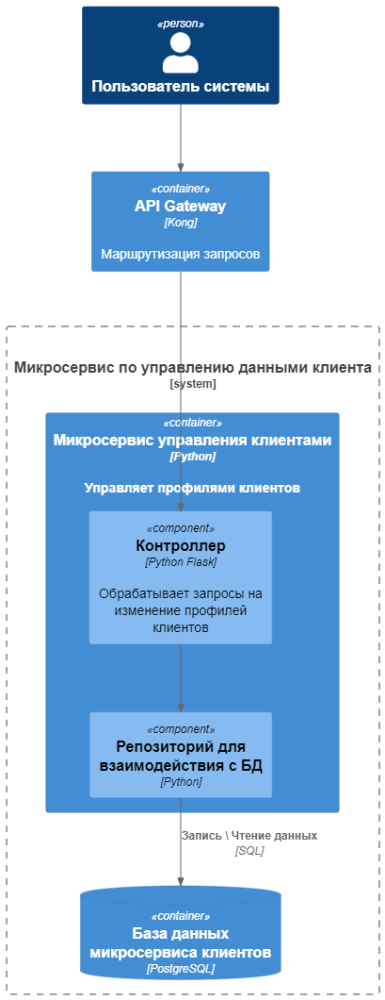
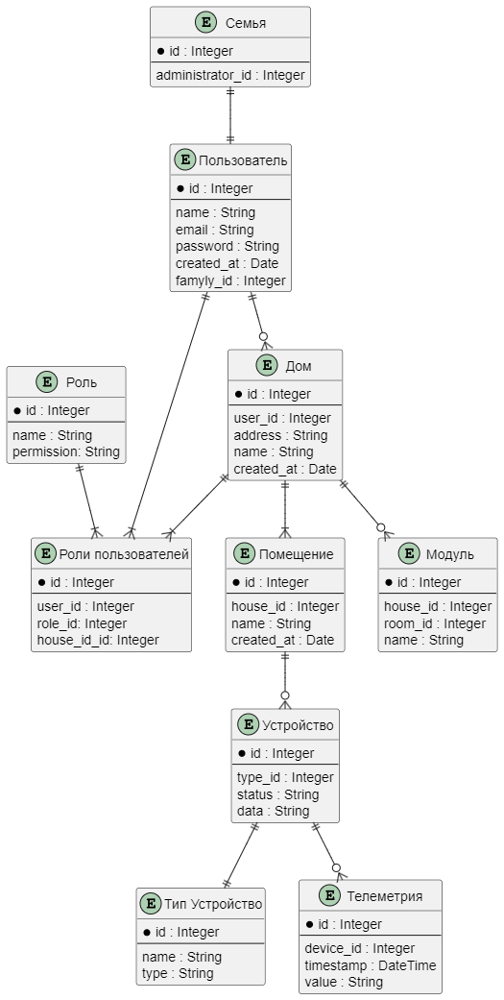

Это шаблон для решения **первой части** проектной работы. Структура этого файла повторяет структуру заданий. Заполняйте его по мере работы над решением.

# Задание 1. Анализ и планирование

Чтобы составить документ с описанием текущей архитектуры приложения, можно часть информации взять из описания компании условия задания. Это нормально.

### 1. Описание функциональности монолитного приложения

**Управление отоплением:**

- Пользователи могут удалённо включать и выключать отопление в своих домах.
- Система поддерживает заданную пользователем температуру

**Мониторинг температуры:**

- Пользователи могут просматривать текущую температуру в своих домах через сайт
- Система получает данные о температуре с датчиков, установленных в домах.

### 2. Анализ архитектуры монолитного приложения

- Язык программирования: Java
- База данных: PostgreSQL
- Архитектура: Монолитная, все компоненты системы (обработка запросов, бизнес-логика, работа с данными) находятся в рамках одного приложения.
- Взаимодействие: Синхронное, запросы обрабатываются последовательно.
- Масштабируемость: Ограничена, так как монолит сложно масштабировать по частям.
- Развёртывание: Требует остановки всего приложения.

### 3. Определение доменов и границы контекстов

1. Управление клиентами
   - Регистрация, редактирование профиля клиента
   - Добавление, редактирование дома клиента
2. Управление устройствами
   - Включение и выключение устройства
   - Установка параметров устройства
   - Регистрация устройства
3. Модуль Телеметрии
   - Передача показаний датчиков
   - Просмотр показаний датчиков

### **4. Проблемы монолитного решения**

- Невозможно подключить новые типы устройств
- Сложность при добавлении нового функционала
- Сложность при развертывании: требуется остановка всего приложения
- Отсутствие асинхронных запросов
- Низкая отказоустойчивость

### 5. Визуализация контекста системы — диаграмма С4

[Визуализация контекста](./diagrams/context1.puml)

# Задание 2. Проектирование микросервисной архитектуры
**Диаграмма контейнеров (Containers)**

[Визуализация контейнеров](./diagrams/containers1.puml)

**Диаграмма компонентов (Components)**

[Компонент профилей](./diagrams/components1.puml)

[Компонент устройств](./diagrams/components2.puml)

[Компонент телеметрии](./diagrams/components3.puml)

**Диаграмма кода (Code)**

[Диаграмма кода](./diagrams/code1.puml)

# Задание 3. Разработка ER-диаграммы
[ER](./diagrams/er1.puml)
